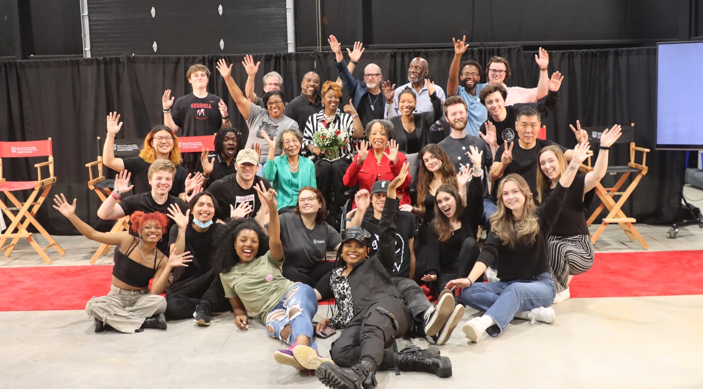

> Status: In post-production

*When the Dogs Left* is a feature-length documentary about the impact and legacy of UGA alumnus Nawanna Lewis Miller and the PAMOJA groups that she founded while a student at the University of Georgia.

Production took place at [Athena Studios](https://athenastudiosga.com/) and was one of the first productions to utilize the space.

## My Role

I became involved with the project through a class offered at the University over the summer. I had the opportunity to collaborate with a phenomenal group of students and faculty, some of whom became regular collaborators.

On-set, I worked as a camera operator and DIT.

